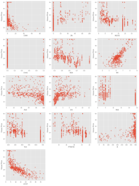
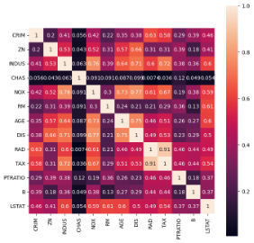
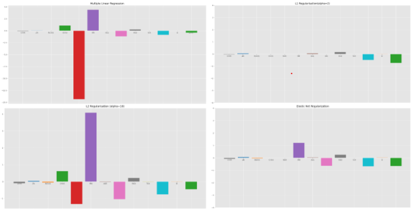

# Elastic Net Regression: Implementation and Comparitive Analysis

## Implementation

In this computational analysis, we delve into the performance of regression models—Linear Regression, Lasso, Ridge, and Elastic Net Regularization—using the Boston Housing Dataset. By evaluating and comparing the effectiveness of these regression techniques in predicting housing prices based on different features, we assess how Elastic Net performs against Lasso and Ridge for the given dataset.

### Exploratory Data Analysis

The Boston Housing Dataset contains 506 samples and 13 features. The scatter plots in Figure 1 show dependence of individual features on housing price. From the 13 features present in the dataset, NOX(nitric oxides concentration (parts per 10 million), RM(average number of rooms per dwelling), DIS(weighted distances to five Boston employment centres), LSTAT (precent lower status of the population), show strong correlation with the Housing Price.

We further investigated the relationships among the 13 features by plotting a collinearity matrix. This matrix pro- vides a comprehensive view of the correlation coefficients between different pairs of variables, shedding light on potential multicollinearity issues. From the matrix given in Figure 1,concluded that there is a strong relationship between the features RAD/TAX, DIS/NOX and DIS/AGE.

`(a) Univariate Analysis`

 

`(b) Feature Correlation`

`Figure 1:Exploratory Data Analysis`

### Methodology & Results

Our analysis involves training four distinct regression models: Linear Regression, Lasso Regression, Ridge Regression, and Elastic Net Regression. Each model employs a specific regularization technique to handle potential overfitting and enhance generalization to unseen data. Hyperparameters such as the regularization strength for Lasso and Ridge, and the mixing parameter for Elastic Net, are carefully chosen to strike a balance between bias and variance.

To ensure a robust evaluation of model performance, the dataset is divided into training and testing sets.We divided the dataset into training and testing data in the ratio 70:30.

For each model we evaluated the coefficients for each feature and the Mean Squared Error. Figure 2 and Table 1 showcases the coefficients obtained in each method, while Table 2 shows the MSE obtained for each model. For comparison purposes, we chose the parameter value as 2 for all cases. Ratio = 0.1 in Elastic Net indicates that the LASSO and ridge parameters are 0.2 and 1.8 respectively.

As observed from the results, Elastic Net regression provides the least MSE, indicating that it’s performance supersedes that of LASSO and Ridge.

### Conclusion

The comparative analysis of the regression models on the Boston Housing Dataset shows Elastic Net Regression as the most effective model, showcasing notable strengths in handling high-dimensional data, managing correlated predictors efficiently, and striking a balance between shrinkage and variable selection. However, there may be certain limitations associated with Elastic Net, such as supoptimal performance with low dimensional data or in cases where there is a high dominance of one penalty over the other. Another drawback is it’s Interpretability, as the model’s complexity may hinder the straightforward interpretation of relationships. Sensitivity to parameter tuning emphasizes the need for careful calibration, as suboptimal choices may impact performance. Despite these limitations, Elastic Net is still a robust choice for predictive modeling due to its adaptability to complex datasets and ability to address multicollinearity.

`Figure 2: Results`

`Table 1: Regression Coefficients for Different Models`

|Variable||MLR|LASSO Ri|dge||ElasticNet||
| - | :- | - | - | - | :- | - | :- |
|CRIM||-0.16|-0.06||-0.16||-0.06|
|ZN||0\.05|0\.05||0\.06||0\.05|
|INDUS||0\.03|NOT INCLUDED||-0.023||-0.04|
|CHAS||3\.45|NOT INCLUDED||2\.8||NOT INCLUDED|
|NOX||-20.17|NOT INCLUDED||-6.9||NOT INCLUDED|
|RM||3\.93|NOT INCLUDED||4\.07||0\.605|
|AGE||0\.002|0\.03||-0.008||0\.04|
|DIS||-1.5|-0.15||-1.32||-0.64|
|RAD||0\.35|0\.2||0\.33||0\.28|
|TAX||-0.01|-0.01||-0.01||-0.01|
|PTRATIO||-0.89|-0.34||-0.75||-0.64|
|B||0\.011|0\.009||0\.012||-0.005|
|LSTAT||-0.48|-0.79||-0.49||-0.85|

`Table 2: Regression Model Comparison`

|Method|Parameters Tes|tMSE Vari|ables Selected|
| - | - | - | - |
|
Multiple Linear Regression LASSO Regression

Ridge Regression

Elastic Net Regression
|
Alpha = 2 Alpha = 2

Alpha = 2

Ratio = 0.1
|
19\.89

28\.98

19\.78 19.26

(
|All (0,1,6,7,8,9,10,11,12) All 0,1,2,5,6,7,8,9,10,11,12)|
